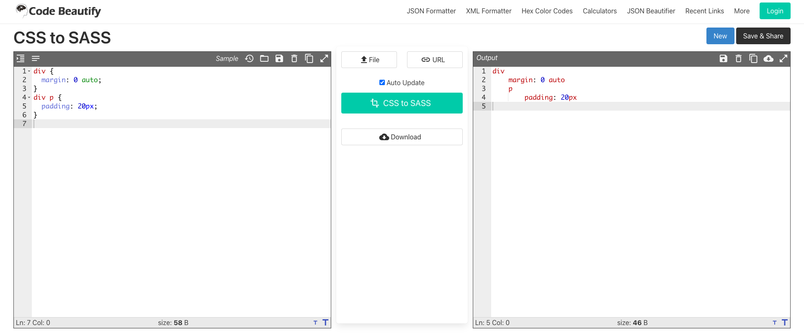

# SassとSASSとSCSS

業務で開発しているリポジトリにsassファイルがあり、また別のリポジトリにはscssファイルがあったので何が違うのかメモ程度の記事にします。
ちなみにSassは少し敬遠しています。。。

## Sass

Sass(Syntactically Awesome StyleSheet)はCSSを拡張して使いやすくわかりやすくしたメタ言語です。
メタ言語(拡張言語)とはある言語に別のルールを定義するために使われる言語のこと。

記事タイトルにあるSassは言語。
そしてこのSassにはSASSとSCSSの2つの記法があります。

## SASS

SASS記法、SASSファイル。この記法で書かれたファイルの拡張子は`.sass`になります。
カギカッコ({})と値の末尾のセミコロン(;)を省略して、インデントを使った記法です。

CSS

```css
div {
    margin: 0 auto;
}

div p {
    padding: 20px;
}
```

Sass(SASS)

```sass
div
    margin: 0 auto
    p
        padding: 20px
```

## SCSS

SCSS記法、SCSSファイル。この記法で書かれたファイルの拡張子は`.scss`になります。
SCSSの場合にはCSSと大きく変わらずネストで表現します。

Sass(SCSS)

```scss
div {
    margin: 0 auto;
    p {
        padding: 20px;
    }
}
```

## CSSからSassへの変換

個人的には記法が複雑なイメージがあったSassを敬遠していたのですが簡単に変換できるサイトがありました。
左側にCSSを入力すると自動的にSassの記法に変換してくれます。



[CSS to SASS converter](https://codebeautify.org/css-to-sass-converter)

[CSS to SCSS converter](https://codebeautify.org/css-to-scss-converter)

## まとめ

* SassはCSSのメタ言語。

* SASS、SCSSはSassの記法。

* 簡単に変換できるから思ったよりも試しやすい。
